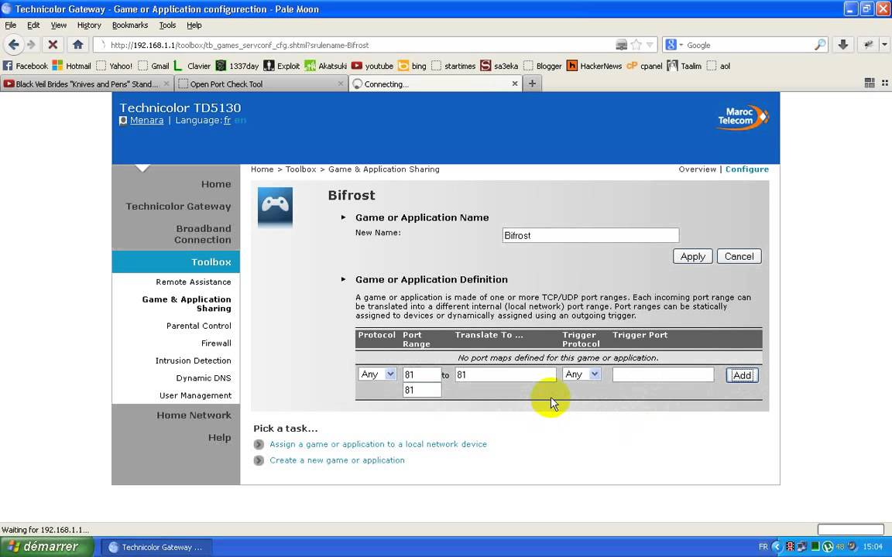

# Documentation Projet

## Informations sur le projet :  
**Quel IDE utilise t'on ?** \
_Webstorm_

**Quel est le langage utilisé ?** \
_javascript_

**Types de javascript :** \
_client et serveur_

**But du TP :** Utiliser le design pattern "singleton".

## TP2

**Objectif TP2 :**

En 30 mn :
  * Comprendre le markdown
  * écrire le debut de la doc du projet

En 10 mn :
  * Restitution (en groupe) écrit en Markdown

__Conception & UI__  
 * Designer la page (wireframe)
 * Page login $
 * Page chat
 * Utilisation de bootstrap
   * https://getbootstrap.com

__Implémentation (avec MAJ de la DOC) :__
 * Mise en place d'une page de login
 * Dialogue avec le serveur NODE.JS
	* Pour login
	* Pour utiliser les utilisateurs

__Travail effectué  :__		
Comparé au premier travail, celui là est nettement plus complet et épuré, socket.io m'a facilité la tache et m'a permis de rendre un travail plus fonctionnel.
Contrairement au premier travail rendu, celui là permet une connextion a distance avec une adresse ip qui est communiquée via la page de login.
Bien qu'une connexion avec un hôte distant soit dangereux, ceci m'a permis de comprendre beaucoup de choses en matière de sécurité en réseau.

Pour se connecter avec un hôte distant il faut  la nécessité d'activer les ports via localhost

Ici sont compilées l'ensemble des fonctionnalités implémentées :

    - Le chat enregistre les utilisateurs dans un fichier texte appelé members.txt
    - Une copie de la conversation est aussi conservée (temps et pseudo) dans un fichier intitulé chat.txt
    - Le chat affiche si les utilisateurs sont connectés ou déconnectés et mets jour leur statut.
    - Quand utilisateur se connecte pour la première fois son pseudo est enregistré et son statut passe au vert
    - Quand il se déconnecte son statu passe au rouge
    - Si on tape le me pseudo l'utilisateur reprends son statut connecté (on ne crée pas un nouveau ) c'est à dire on vérifie s'il existe
    - Le nom du client n’apparaît pas dans sa page
    - les messages apparaissent à droite
    - Liste des membres
    - Message de bienvenue
    - Nombre de membres connectés
    - gestion des erreurs
    - Un utilisateur ne peut pas avoir plusieurs pseudo
    - Des utilisateur ne peuvent pas avoir le même pseudo
    - Erreur adresse Ip non trouvée
    - Pour la connection a distance il faut ouvrir les ports ! voir documentation.
   
   

__DOCUMENTATION PROJET :__

    Inspiration : Chat telegram.

    Nous utilisons markdown pour la documentation du projet.
    https://www.markdownguide.org

		Pour la connection a distance j'ai suivi ce tuto :
		https://www.youtube.com/watch?time_continue=7&v=EbOgQIXXffI&feature=emb_title

	    J'ai décidé d'utiliser socket.io pour le chat
		https://socket.io/
	   
	    Ne pas oublier d'installer le module dans le dossier node_modules
		npm install socket.io

	    Plus sur socket.io :
	    - Un des modules npm les plus utilisés
	    - Socket.IO est une bibliothèque qui permet une communication en temps réel, bidirectionnelle et basée sur les événements entre le navigateur et le serveur.
	      Cela consiste en:
            - Un serveur Node.js: Source | API
            - Une bibliothèque client Javascript pour le navigateur (qui peut également être exécutée à partir de Node.js): Source | API

	    Travail a rendre à l'adresse suivante : cmassart@timgroup.fr
